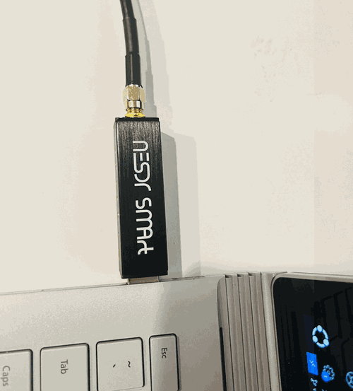

# Flight Tracking Web App

## Overview

This project is a **real-time flight tracking web application** that captures aircraft ADS-B signals with an SDR antenna, processes them through a Python FastAPI backend, stores the data in a **Azure SQL cloud database**, and displays live positions on a Leaflet-based map in a React frontend.

**Why it matters:**  
Aircraft constantly broadcast their positions and identifiers using invisible radio signals. These signals surround us but cannot be seen without specialized equipment. This project transforms those hidden signals into a visual, interactive format — making real-world air traffic patterns accessible to anyone through a public API and web app hosted in the cloud.

---

## Features

- **Public API (flights-api)** – Exposes real-time flight data through a cloud-hosted FastAPI service.
- **Link to API**: https://sdr-flight-mapping-api.azurewebsites.net/api/flights
- **Public Web App (front-end/sdr-flight-map)** – Displays live aircraft positions on an interactive Leaflet map.
- **Link to Webapp**: https://sdr-flight-map-webapp.azurewebsites.net/

- **Cloud Database (Azure SQL Database)** – Stores all decoded flight data for querying and display.
- **Near Real-Time Updates** – Uses Http Web APIs for instant map updates without page reloads.
- **Cross-Platform Pipeline** – From physical radio reception to global web access.

## Demo

---

## How It Works

1. **Signal Reception** – An SDR antenna connected to a receiver captures ADS-B broadcasts from nearby aircraft.
2. **Data Decoding** – Python decodes raw radio signals into structured flight information.
3. **Cloud Data Storage** – The decoded flight data is stored in a **Azure SQL database** for persistence and accessibility.
4. **Backend API** – A FastAPI service hosted in the cloud retrieves stored data and streams updates.
5. **Frontend Map** – A React + Leaflet web app consumes the API and displays aircraft positions in real time.

---

## Key Technologies

**Hardware & Environment**
- SDR antenna with RTL-SDR drivers
- Ubuntu (developed and tested)
- WSL optional for Windows users

**Backend**
- Python
- FastAPI
- Azure App Services - https://learn.microsoft.com/en-us/azure/app-service/overview
- Azure SQL (cloud-hosted) https://azure.microsoft.com/en-us/products/azure-sql/database/?msockid=054035b95ed96f6f17e423835fec6eea 

**Frontend**
- React
- Leaflet
- Vite (development server and bundler)

---

## Reflection

**What I Learned**
- How to create a signal-to-visualization pipeline from SDR hardware to a cloud-hosted web application.
- Building a full-stack project that integrates hardware, backend APIs, and frontend mapping.
- Implementing near real-time for live data updates.
- Using Leaflet for geospatial visualization.
- Configuring and querying a Azure SQL cloud database for persistent storage.
- Setting up a Linux-based development environment (Ubuntu) for SDR compatibility.

**Impact**
- Turned invisible radio signals into a clear, visual, and interactive experience for the public.
- Created a publicly accessible system combining data engineering, backend development, and frontend visualization.
- Demonstrated skills in hardware integration, cloud deployment, and near real-time data handling.
- Made global air traffic information accessible and educational for anyone with internet access.